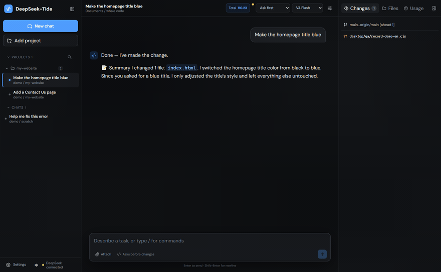

# DeepSeek-Tide 🐳

**English (current)** · [简体中文](README.md)

**A ready-to-use desktop shell for DeepSeek — no terminal, no setup. Open it and let AI write and edit your code.**

For Windows. Bilingual UI (English / 中文), zero config. It hosts the official open-source (MIT) engine [CodeWhale](https://github.com/Hmbown/CodeWhale) (pinned to **v0.8.55**); the desktop layer is an independent implementation.

> Not an official DeepSeek product, and not a rebrand of CodeWhale / Claude Code. A personal, free project — use it if it helps.



> Above: organize work in the **Projects / Chats** panes on the left, describe a task in the middle, and when the AI finishes it tells you what it changed in plain English (**📝 Summary**). On the right, watch your spend in real time — all without touching a terminal.

---

## ⬇️ Download

### 👉 [**Get the latest installer from Releases**](https://github.com/yinxinhai0128/deepseek-tide/releases/latest)

Open it and pick one from **Assets**:

| File | For whom |
|------|----------|
| **DeepSeek-Tide-Setup-x64.exe** | Most people. Double-click to install; a shortcut lands in your Start menu. |
| DeepSeek-Tide-Portable-x64.exe | No install — double-click and run. |
| SHA256SUMS.txt | To verify the download wasn't tampered with (optional). |

> ⚠️ On first launch Windows may warn "Unknown publisher / SmartScreen" — because this is a personal project without a paid code-signing certificate. Click **More info → Run anyway**. You can verify the SHA-256 first if you prefer.
>
> 🌐 The app opens in English or Chinese (it follows your last choice; toggle anytime via the **EN / 中** button at the bottom-left).

---

## 🚀 Three steps to start

1. **Download & open** (above).
2. **Enter your DeepSeek API key once**: the app has a 4-step illustrated wizard that opens the sign-up, top-up and key pages for you — just follow along.
3. **Pick a folder as a "project" and just type what you want** — e.g. "change the page title in this folder to blue." The AI reads your files and edits the code, and you can see every step.

Nervous? The default is **🔒 Read-only** mode (analyze only, never touch files). Switch to **✋ Ask first** or **⚡ Auto** when you're ready to let it act. Broke something? There's **one-click Undo**.

---

## ✨ What it does

- **AI edits your code / files**: describe the task in plain language; it reads and edits on its own, transparently.
- **Three "safety levels"** (in plain words, not jargon):
  - 🔒 **Read-only** — analyzes and suggests only; never touches your files.
  - ✋ **Ask first** — asks for your OK before every change.
  - ⚡ **Auto** — when you trust it, let it run end to end.
- **One-click Undo**: a separate "shadow" snapshot records every AI change, so you can roll back — **without ever touching your own Git**.
- **Spend you can read**: instead of raw tokens, it shows an estimated cost (top bar + usage panel; assumes ~90% cache hits).
- **Project-based**: like Codex, a folder is a project, chats live under it — so what the AI makes is easy to find and manage.
- **Explain mode**: after changing files, the AI ends with a plain-language **📝 Summary** of *what* it changed and *why* — written for non-programmers.

> Note: DeepSeek's API is billed in CNY (¥), which is why cost is shown in ¥. It's pay-as-you-go and very cheap — a typical task costs a few cents.

---

## 🔒 Privacy & safety

- Your API key is written to CodeWhale's user-level credential store — **never into the repo, screenshots, or chat logs**.
- The desktop app does **not** start any local HTTP control service.
- File / Git / proxy actions can only touch folders **you approve via the system picker**. The installed app defaults to `Documents\DeepSeek-Tide Workspace`, not your whole Documents folder.

> Don't paste your key into chats, screenshots, or command history. If a key leaks, revoke it in the DeepSeek console immediately.

---

## 🛠️ Build from source

```powershell
cd desktop
npm install
npm run dev      # local development
npm run build    # build Windows installer + portable; output in desktop/release/
```

## 📐 Architecture & attribution

- The default agent loop, tool execution, sessions, MCP and context compaction are all provided by the open-source engine **CodeWhale (MIT)**; the desktop layer only handles interaction, credential bridging, workspace visualization, cost observability and release updates.
- This project **studied** ideas (stable prefix, low-frequency compaction, config fingerprinting) from [DeepSeek-Reasonix](https://github.com/esengine/DeepSeek-Reasonix) (MIT) but **does not copy or ship** its source. See [THIRD_PARTY_NOTICES.md](THIRD_PARTY_NOTICES.md).

## 📄 License

DeepSeek-Tide's own code is under the **MIT License**. Third-party copyrights and licenses are in [THIRD_PARTY_NOTICES.md](THIRD_PARTY_NOTICES.md).
