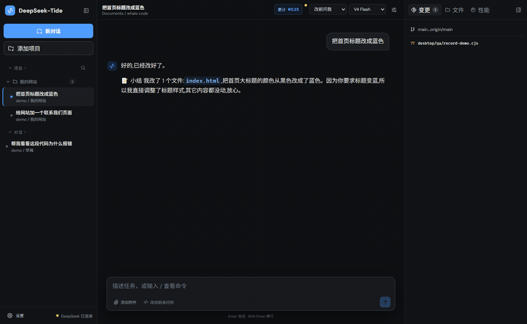
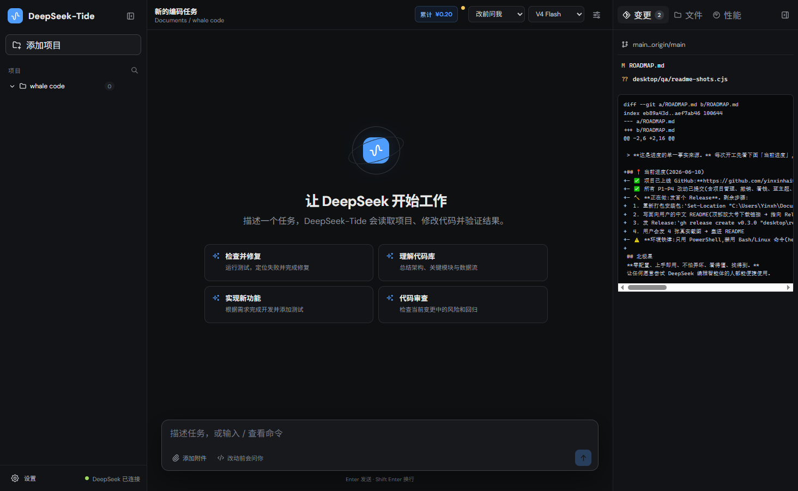
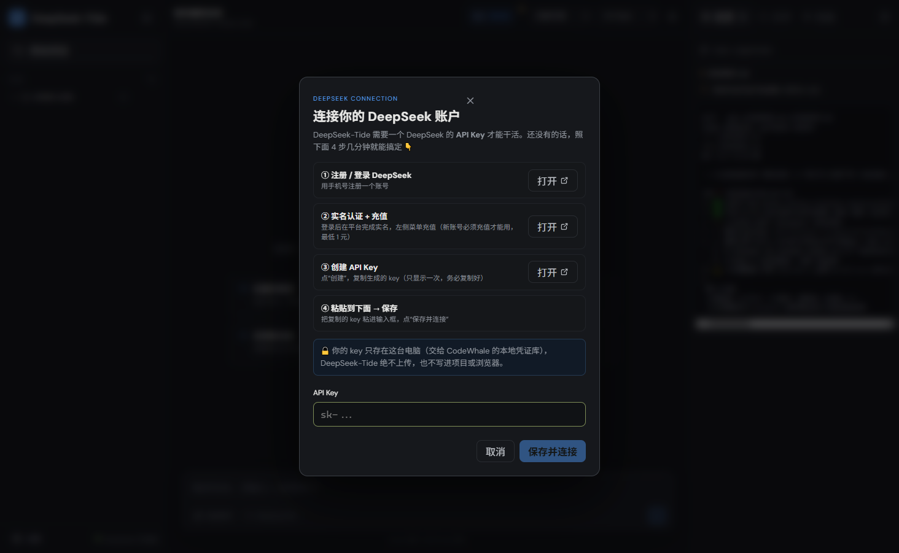
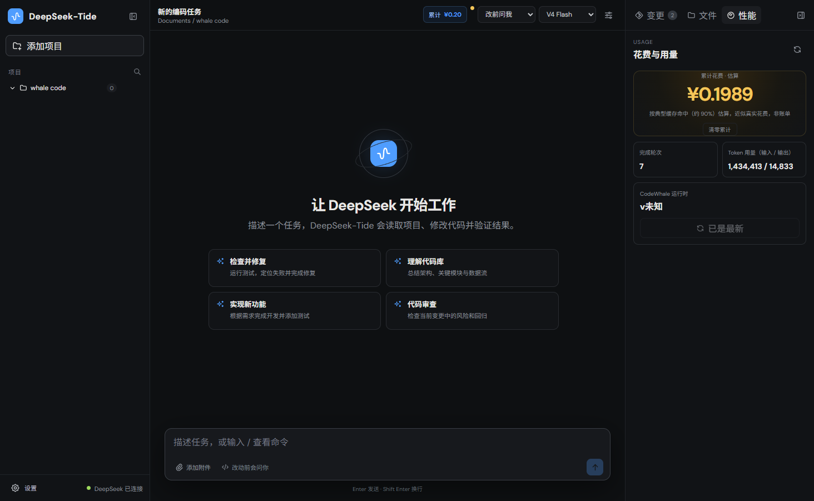
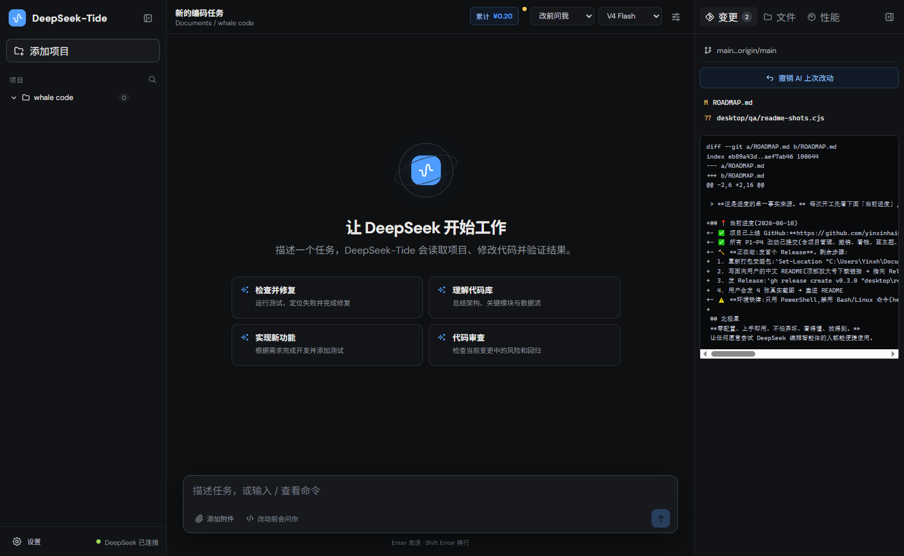

# DeepSeek-Tide 🐳

[English](README.en.md) · **简体中文(当前)**

**给 DeepSeek 套了一个"上手即用"的桌面外壳 —— 不用装终端、不用配环境,打开就能让 AI 帮你写代码、改文件。**

面向 Windows,中文界面,零配置。底层托管官方开源(MIT)引擎 [CodeWhale](https://github.com/Hmbown/CodeWhale)(当前锁定 **v0.8.55**),桌面层是独立实现。

> 这不是 DeepSeek 官方产品,也不是 CodeWhale / Claude Code 的改名版。个人作品,免费,有人愿意用就用。



> 上图:左边「项目 / 对话」两栏整理任务,中间提需求、AI 干完用大白话「📝 小结」告诉你改了啥,右边实时看花费 —— 全程不碰终端。

---

## ⬇️ 下载安装(点这里)

### 👉 [**到「Releases」下载最新版安装包**](https://github.com/yinxinhai0128/deepseek-tide/releases/latest)

打开后,在 **Assets** 里选一个下载:

| 文件 | 适合谁 |
|------|--------|
| **DeepSeek-Tide-Setup-x64.exe** | 大多数人。双击安装,开始菜单里就有图标。 |
| DeepSeek-Tide-Portable-x64.exe | 不想安装的人。双击直接运行,免安装。 |
| SHA256SUMS.txt | 校验文件没被篡改用的(可选,看不懂就忽略)。 |

> ⚠️ 首次打开,Windows 可能弹"未知发布者 / SmartScreen"提示 —— 因为这是个人作品、暂未做付费代码签名。点 **更多信息 → 仍要运行** 即可。介意的话可以先用上面的 SHA256 校验。

---

## 🚀 三步开始用

1. **下载安装**(见上)→ 打开 DeepSeek-Tide。
2. **填一次 DeepSeek 的 API Key**:软件里有「4 步图文向导」,带你一键打开注册页、充值页、拿 Key 页,跟着点就行。
3. **选个文件夹当"项目",直接打字提需求** —— 比如"帮我把这个文件夹里的网页标题改成蓝色"。AI 会自己读文件、改代码,你能看到它每一步做了啥。

不放心?默认是 **🔒 只看不改** 模式;想让它动手再切 **✋ 改前问我** 或 **⚡ 放手干**。改坏了有 **一键撤销**。

---

## 📸 界面预览

> (截图占位,稍后补上)

| 主界面 | 开通向导 |
|--------|----------|
|  |  |

| 花费一目了然 | 一键撤销 |
|--------------|----------|
|  |  |

---

## ✨ 它能帮你做什么

- **AI 帮你改代码 / 文件**:用大白话提需求,它自己读、自己改,过程透明可见。
- **三种"安全档位"**(讲人话,不是黑话):
  - 🔒 **只看不改** —— 只分析、只建议,绝不动你的文件。
  - ✋ **改前问我** —— 每次动手前先征求你同意。
  - ⚡ **放手干** —— 你信得过它时,让它一口气干完。
- **一键撤销**:用独立的"影子存档"记录 AI 的每次改动,后悔了一键还原,**完全不碰你自己的 Git**。
- **看得懂花费**:不给你看一堆 token,直接折算成**人民币花费估算**,顶栏和性能面板都能看(按约 90% 缓存命中近似)。
- **项目化管理**:像 Codex 那样,一个文件夹就是一个项目,对话挂在项目下,AI 生成的东西"找得到、管得着"。
- **本土化零配置**:中文界面、自动探测代理、一键开通向导,专治"怕终端、怕英文、怕配环境"。

---

## 🔒 隐私与安全

- API Key 通过标准输入写入 CodeWhale 的用户级凭证存储,**不写进仓库、不进截图、不进聊天记录**。
- 桌面端**不**开启任何本地 HTTP 控制服务。
- 文件 / Git / 代理操作,只能访问你**亲手用系统选择器批准的文件夹**。安装版默认工作区是 `文档\DeepSeek-Tide Workspace`,不会默认开放整个文档目录。
- 缓存画像只存 SHA-256 哈希和变化类别,**不存** Key、提示词或会话内容。

> 别把 API Key 贴进聊天、截图或命令历史。一旦泄露,请到 DeepSeek 控制台立刻撤销重置。

---

## 🛠️ 开发者:从源码构建

```powershell
cd desktop
npm install
npm run dev      # 本地开发
npm run build    # 打包 Windows 安装版 + 便携版,产物在 desktop/release/
```

命令行运行时(安装/刷新官方 CodeWhale 引擎):

```cmd
install.cmd
deepseek-tide.cmd -p "检查这个仓库,运行测试并修复失败"
deepseek-tide.cmd auth set --provider deepseek
```

代理(不设则自动探测 `7897 / 7890 / 10809 / 1080`):

```powershell
$env:DEEPSEEK_TIDE_PROXY = "http://127.0.0.1:7890"
.\install.cmd
```

测试:

```powershell
cd desktop
npm test
npm run build:renderer
```

---

## 📐 架构与来源(合规)

- 默认代理循环、工具执行、会话、MCP、上下文压缩 **全部由开源引擎 CodeWhale(MIT)提供**;桌面层只做交互、凭证桥接、工作区可视化、花费可观测与发行更新。
- 本项目**研究**了 [DeepSeek-Reasonix](https://github.com/esengine/DeepSeek-Reasonix)(MIT)中稳定前缀、低频压缩、配置指纹等思想,但**未复制或发布** Reasonix 源码。设计记录见 [THIRD_PARTY_NOTICES.md](THIRD_PARTY_NOTICES.md)。
- `src/whaletide` 是早期 clean-room Python 后备实现,保留内部包名以兼容旧脚本,**不是默认入口**。

## 📄 许可

DeepSeek-Tide 自有代码使用 **MIT License**。第三方版权与许可见 [THIRD_PARTY_NOTICES.md](THIRD_PARTY_NOTICES.md)。
